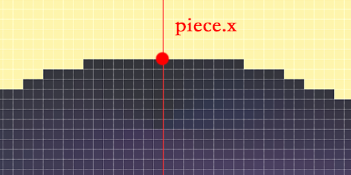
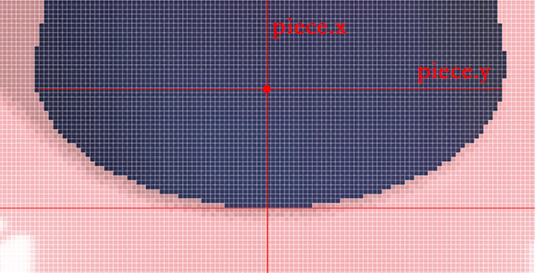
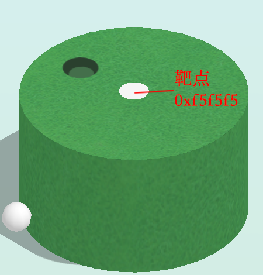
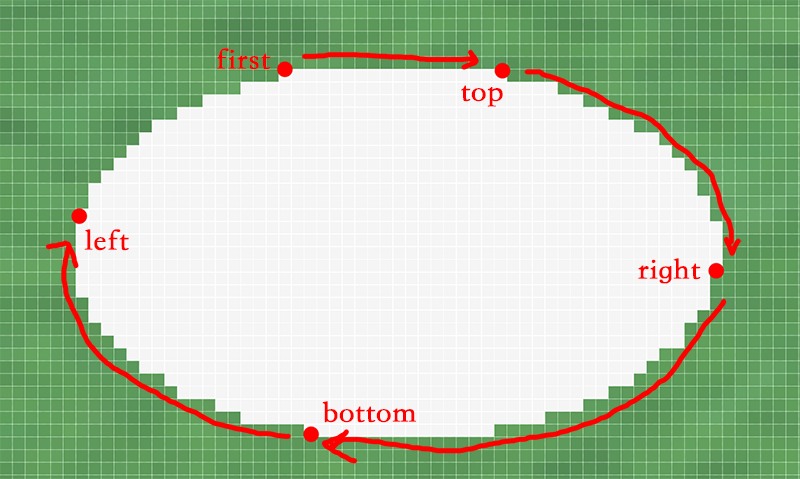
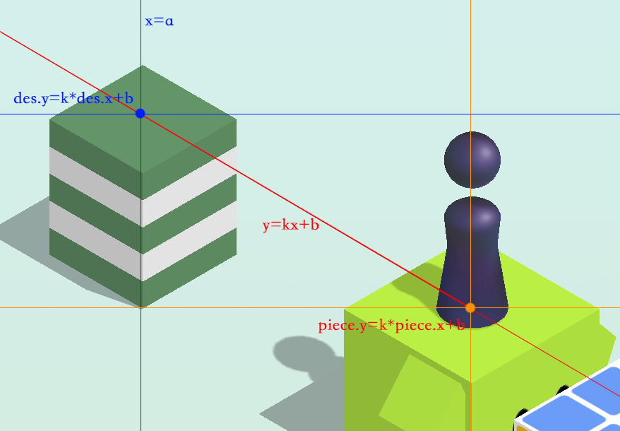
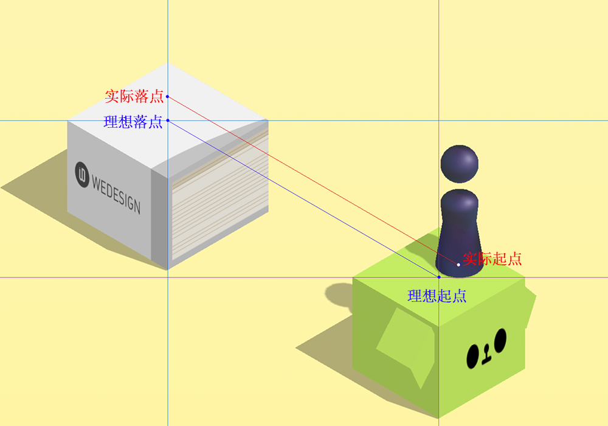
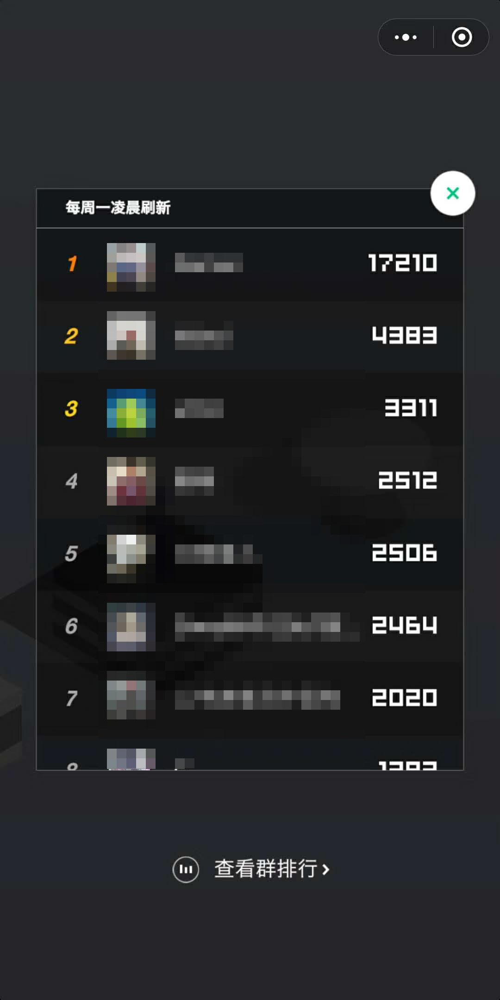

# 微信跳一跳游戏助手

 [GitHub 项目地址](https://github.com/xushanmeng/WechatJumpHelper)

## 功能简介

>用JAVA自动控制手机玩跳一跳

* 自动识别图像计算距离
* 自动帮你点击屏幕
* 自动缓存图片，并在图片上标记一些识别结果，如下图


## 运行环境
1. JAVA，最低版本为7.0，[官网下载](http://www.oracle.com/technetwork/java/javase/downloads/index.html)
2. adb驱动，[官网下载(需要翻墙)](https://developer.android.com/studio/releases/platform-tools.html)，或者到[这里](http://www.android-studio.org)下载SDK-tools，其中就包含adb
3. 安卓手机，目前已适配分辨率
    * 1600x2560
    * 1440x2560
    * 1080x1920
    * 720x1280

## 使用方法

>有JAVA开发工具的同学可以直接运行java代码，便于代码调试，下面主要介绍运行已经打包好的jar包的方法

1. 手机打开USB调试，并连接电脑
    * 打开USB调试方法，进入`设置`，找到`开发者选项`，打开并勾选`USB调试`；
    * 如果没有`开发者选项`，进入`关于手机`，连续点击`版本号`7次，即可开启`开发者选项`。   
2. 通过下面的命令，运行[Android.jar](Android/build/libs/Android.jar)
    ```
    java -jar Android.jar
    ```   
3. 根据手机分辨率选择跳跃系数，目前已适配机型：

    * 1600x2560机型推荐0.92
    * 1440x2560机型推荐1.039
    * 1080x1920机型推荐1.392
    * 720x1080机型推荐2.078 
    
    其他分辨率请自己微调。
    
## 原理说明
1. 通过adb命令控制手机截图，并取回到本地

    ```
    adb shell screencap -p /sdcard/screen.png
    adb pull /sdcard/screen.png .
    ```
    
2. 图片分析
    * 根据棋子的颜色，取顶部和底部的特征像素点，在截图中进行匹配，找到棋子坐标
    * 由于目标物体不是在左上就是在右上，可以从上往下扫描，根据色差判断目标物体位置，其中又分为以下几种类型
        * 有靶点，即目标物体中心的白色圆点，则靶点中心为目标落点
        
        
        * 无靶点，但是纯色平面，或者规则平面，则平面中心为目标落点
        
        
        * 无靶点，又无纯色规则平面，但是左上和右上位置的斜率是固定的，可根据固定斜率的斜线和目标物体中心线的焦点计算落点
        
        
    * 计算棋子坐标和目标落点的距离
    * 距离×跳跃系数=按压屏幕的时间，不同分辨率的手机，跳跃系数也有所不同
    
3. 通过adb命令，给手机模拟按压事件
    ```
    adb shell input swipe x y x y time
    ```
    其中`x`和`y`是屏幕坐标，`time`是触摸时间，单位ms。
    
## 工程结构
```目录结构
.
├── Samples             # 一些示例图片
├── Android             # 使用Android手机的相关代码和jar包
│   ├── src             # JAVA源代码目录
│   └── build           # Android.jar包所在目录
└── README.md
```
## 代码详解

>这里将针对一些关键算法的代码进行解释

1. 寻找棋子位置

    把截图放大，可以看到棋子顶部像素连成一条横线，那么我们通过颜色匹配，找到这一条线的始末位置，取中间位置，就得到了棋子的x坐标。

    

    棋子的底部也是一条横线，用颜色匹配，我们检测到相似颜色的最大y坐标，就是棋子底部了，不过考虑到棋子底部是个圆盘，我们把棋子的y坐标再往上提一些。

    

    这样我们就得到了棋子的xy坐标，下面是相关代码：
    
    ```java
    /* 计算棋子位置 */
    Pixel piece = new Pixel();
    for (int i = TOP_BORDER; i < screenHeight - BOTTOM_BORDER; i++) {
        int startX = 0;
        int endX = 0;
        for (int j = LEFT_BORDER; j < screenWidth - RIGHT_BORDER; j++) {
            int red = Color.red(pixels[i][j].color);
            int green = Color.green(pixels[i][j].color);
            int blue = Color.blue(pixels[i][j].color);
            if (50 < red && red < 55
                    && 50 < green && green < 55
                    && 55 < blue && blue < 65) {//棋子顶部颜色
                //如果侦测到棋子相似颜色，记录下开始点
                if (startX == 0) {
                    startX = j;
                    endX = 0;
                }
            } else if (endX == 0) {
                //记录下结束点
                endX = j;
    
                if (endX - startX < PIECE_TOP_PIXELS) {
                    //规避井盖的BUG，像素点不够长，则重新计算
                    startX = 0;
                    endX = 0;
                }
            }
            if (50 < red && red < 60
                    && 55 < green && green < 65
                    && 95 < blue && blue < 105) {//棋子底部的颜色
                //最后探测到的颜色就是棋子的底部像素
                piece.y = i;
            }
        }
        if (startX != 0 && piece.x == 0) {
            piece.x = (startX + endX) / 2;
        }
    }
    //棋子纵坐标从底部边缘调整到底部中心
    piece.y -= PIECE_BOTTOM_CENTER_SHIFT;
    ```

2. 寻找靶点

    所谓靶点，就是目标物体中心的那个小圆点，颜色值为`0xf5f5f5`。

    
    
    那么我们只需要寻找颜色值为0xf5f5f5的色块就可以了，为了规避其他物体相近颜色干扰，我们可以限制色块的大小，正确大小的色块才是靶点。
    
    但是如何计算色块的大小呢，色块最顶端到最底端y坐标的差值我们作为色块的高度，同理，最左侧到最右侧x坐标的差值作为宽度，我们只需要查找这四个顶点的坐标就可以了。
    
    本来打算用凸包的Graham扫描算法，后来发现色块已经是凸包了，且边缘像素是连续的，那么我们按照一定顺序，遍历边缘像素，就可以在O(n^-2)的时间复杂度里，得到色块的顶点坐标了。
    
    我们从第一个像素点开始，寻找的顺序如图所示：
    
    
    
    ```java
        /**
         * 寻找色块顶点像素
         */
        public static final Pixel[] findVertexs(Pixel[][] pixels, Pixel firstPixcel) {
            Pixel[] vertexs = new Pixel[4];
            Pixel topPixel = firstPixcel;
            Pixel leftPixel = firstPixcel;
            Pixel rightPixel = firstPixcel;
            Pixel bottomPixel = firstPixcel;
            Pixel currentPixcel = firstPixcel;
            //先把坐标置于左上角
            while (checkBorder(pixels, currentPixcel)//判断是否超出图像边缘
                    && Color.compareColor(pixels[currentPixcel.y - 1][currentPixcel.x], firstPixcel)) {//判断是否是相同颜色
                currentPixcel = pixels[currentPixcel.y - 1][currentPixcel.x];
            }
            while (checkBorder(pixels, currentPixcel)
                    && Color.compareColor(pixels[currentPixcel.y][currentPixcel.x - 1], firstPixcel)) {
                currentPixcel = pixels[currentPixcel.y][currentPixcel.x - 1];
            }
            //寻找上顶点像素
            while (checkBorder(pixels, currentPixcel)) {
                if (Color.compareColor(pixels[currentPixcel.y - 1][currentPixcel.x], firstPixcel)) {
                    currentPixcel = pixels[currentPixcel.y - 1][currentPixcel.x];
                } else if (Color.compareColor(pixels[currentPixcel.y][currentPixcel.x + 1], firstPixcel)) {
                    currentPixcel = pixels[currentPixcel.y][currentPixcel.x + 1];
                } else {
                    topPixel = findCenterPixcelHorizontal(pixels, currentPixcel);
                    break;
                }
            }
            //寻找右顶点像素
            while (checkBorder(pixels, currentPixcel)) {
                if (Color.compareColor(pixels[currentPixcel.y][currentPixcel.x + 1], firstPixcel)) {
                    currentPixcel = pixels[currentPixcel.y][currentPixcel.x + 1];
                } else if (Color.compareColor(pixels[currentPixcel.y + 1][currentPixcel.x], firstPixcel)) {
                    currentPixcel = pixels[currentPixcel.y + 1][currentPixcel.x];
                } else {
                    rightPixel = findCenterPixcelVertial(pixels, currentPixcel);
                    break;
                }
            }
            //寻找下顶点像素
            while (checkBorder(pixels, currentPixcel)) {
                if (Color.compareColor(pixels[currentPixcel.y + 1][currentPixcel.x], firstPixcel)) {
                    currentPixcel = pixels[currentPixcel.y + 1][currentPixcel.x];
                } else if (Color.compareColor(pixels[currentPixcel.y][currentPixcel.x - 1], firstPixcel)) {
                    currentPixcel = pixels[currentPixcel.y][currentPixcel.x - 1];
                } else {
                    bottomPixel = findCenterPixcelHorizontal(pixels, currentPixcel);
                    break;
                }
            }
            //寻找左顶点像素
            while (checkBorder(pixels, currentPixcel)) {
                if (Color.compareColor(pixels[currentPixcel.y][currentPixcel.x - 1], firstPixcel)) {
                    currentPixcel = pixels[currentPixcel.y][currentPixcel.x - 1];
                } else if (Color.compareColor(pixels[currentPixcel.y - 1][currentPixcel.x], firstPixcel)) {
                    currentPixcel = pixels[currentPixcel.y - 1][currentPixcel.x];
                } else {
                    leftPixel = findCenterPixcelVertial(pixels, currentPixcel);
                    break;
                }
            }
            vertexs[0] = leftPixel;
            vertexs[1] = topPixel;
            vertexs[2] = rightPixel;
            vertexs[3] = bottomPixel;
            return vertexs;
        }
    ```
    得到了四个坐标点，我们就可以计算色块的中点了，也就是目标落点。
    
    对于没有靶点，但是落点是规则平面的，也可以用类似算法。

3. 斜率计算
    对于没有靶点，又不是规则平面的，我们怎么计算落点呢，这时候就要用到斜率了。
    
    可以看得出来，每次左上角或右上角出现的物体，针对当前物体的方向都是一样的，也就是两个物体中心的连线，斜率是固定的。
    
    基本所有的目标物体，最顶点像素中点的x坐标，都是在物体中间，我们至少先得到了目标物体x坐标了，记为des.x ，接下来要求des.y 。
    
    
    
    如上图所示，计算过程如下：
    ```
        斜线的公式为 y=kx+b 
        那么，在棋子坐标上有 piece.y=k*piece.x+b 
        在目标落点坐标上有 des.y=k*des.x+b
        代入得到 des.y=k*(des.x-piece.x)+piece.y
    ```
    然而这种算法还是有偏差的。
    
    
    
    可以看到，同样的斜率，如果棋子的位置有偏差，计算出来最终落点还是会有偏差的。
    
    代码解析就先讲这么多，希望有大神可以提出更好的解决方案。
 
## 玩游戏小窍门
1. 连续的落到物体中心位置，是有分数加成的，最多跳一次可以得几十分
2. 井盖、商店、唱片、魔方，多停留一会，有音乐响起后也是有分数加成的
>那么看一下程序员的朋友圈有多残酷吧


